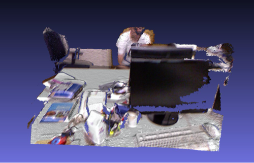

## Kinect Fusion

### Project overview

The goal of this project is to obtain a 3D reconstruction of a static scene which was recorded with a Kinect camera.

### Results

Below you can see a result of a raycast which was performed after ~120 frames.

### Setup (Linux)

- If you're contributing, please use `cpplint`\
  Install via: `pip install cpplint`\
  Run with: `cpplint [OPTIONS] files`

- Install `cmake` if it's not installed yet\
  `sudo apt-get install cmake`

- Run `sudo apt-get install libfreeimage3 libfreeimage-dev` in order to be able to process images from the dataset by simulating the virtal sensor

- Clone the repo\
  `git clone https://github.com/VladimirYugay/KinectFusion.git`

- Download header only Eigen library and put it into `libs` folder by runnning:\
  `cd KinectFusion/libs`\
  `git clone https://gitlab.com/libeigen/eigen.git`

- Download the dataset from [here](/home/vladimir/university/3d_scanning_and_motion_capture/3DSaMC/data/exercise_1_data) and save it under `KinectFusion/data` folder

- Build and run the project \
  `cd ..`\
  `mkdir build`\
  `cd build`\
  `cmake ..`\
  `make`\
  `./kinect_fusion`

### Setup (Windows)

- Follow the same file structure as in Linux Setup
- Add pre-compiled libraries of FreeImage in `KinectFusion/libs`
